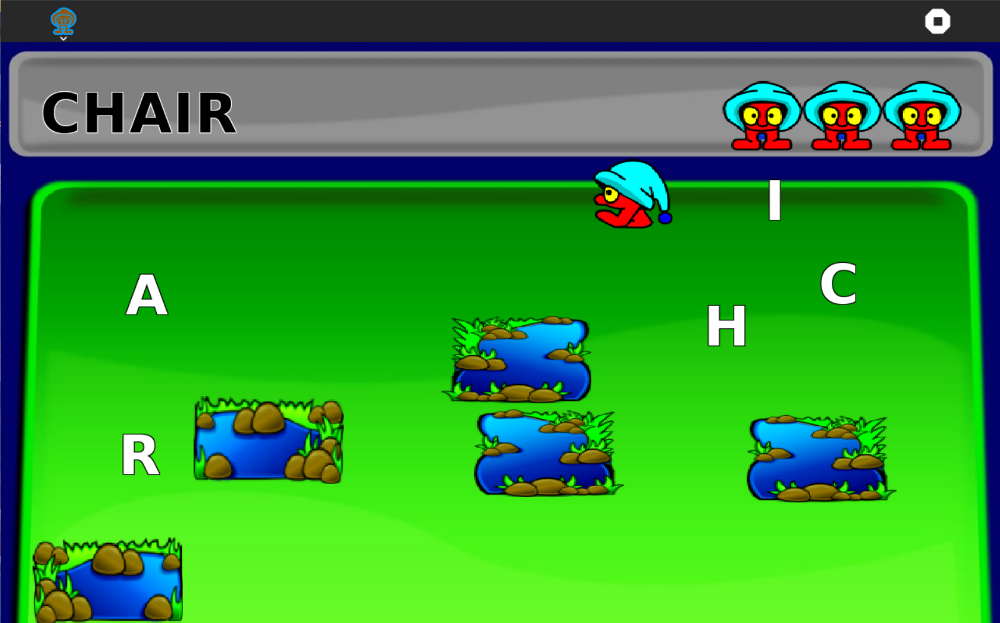

What is this?
=============

Falabracman-activity is a Sugar activity to learn some words, by collecting all the letters in the right order and by avoiding the lake otherwise you will fall into it.



How to use?
===========

Falabracman-activity is not part of the Sugar desktop, but can be added.  Please refer to:

* [How to Get Sugar on sugarlabs.org](https://sugarlabs.org/),
* [How to use Sugar](https://help.sugarlabs.org/),
* [Download Falabracman-activity using Browse](https://activities.sugarlabs.org/), search for `Falabracman`, then download.

How to upgrade?
===============

On Sugar desktop systems;
* use [My Settings](https://help.sugarlabs.org/my_settings.html), [Software Update](https://help.sugarlabs.org/my_settings.html#software-update), or;
* use Browse to open [https://activities.sugarlabs.org](https://activities.sugarlabs.org), search for `Falabracman`, then download.

How to run?
=================

Falabracman-activity depends on Python, PyGTK and PyGame.

Falabracman-activity is started by [Sugar](https://github.com/sugarlabs/sugar).

**Running inside Sugar**

- Activity can be run from the activity ring, you'll open
  terminal activity and clone the activity first.
```
git clone https://github.com/sugarlabs/falabracman-activity
```

- Change to the Falabracman-activity activity directory
```
cd Activities/falabracman-activity
# Set up activity for development 
python3 setup.py dev
```

- Go to activity ring and search for Falabracman-activity and run.

- Activity can also be run from the terminal by running while in
  activity directory
```
sugar-activity3 .
```

Reporting Bugs
--------------

Bugs can be reported in the
[issues tab](https://github.com/sugarlabs/falabracman-activity/issues)
of this repository.

Contributing
------------

Please consider [contributing](https://github.com/sugarlabs/sugar-docs/blob/master/src/contributing.md) to the project with your ideas and your code.